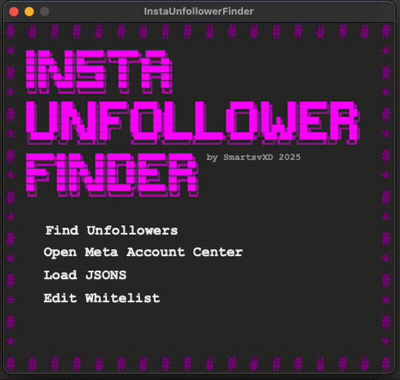

# Instagram Unfollower Finder

A lightweight tool that helps you manage your Instagram connections efficiently.

Easily identify the people you follow but who don't follow you back  
**No password or username required, and 100% privacy-friendly!**

  

## ❓ What is this?

Instagram (via Meta) allows you to download your personal data, including your followers and following lists.  
This tool compares those lists locally to show you who doesn’t follow you back. It’s fast, simple, and keeps your data safe on your device.

## 📗 Quick Guides

### 👉 [Run Compiled (read this if you want to just use the app)](docs/COMPILED_GUIDE.md)

### 👉 [Run Source Code](docs/SOURCE_CODE_GUIDE.md)

### 👉 [How to Request and Download Your Instagram Data](docs/INSTAGRAM_DATA_GUIDE.md)

## 📌 FAQ

### 👉 [Frequently Asked Questions (FAQ)](docs/FAQ.md)

## 🔒 Security Notice

The compiled versions of this app are not digitally signed (the certificate is expensive and I'm poor 👍). This means both macOS and Windows may block the application when you try to open it, as the system doesn't recognize the developer. Here's how to bypass this and run the app safely.

### Running the App on Windows

- Double-click to open the app. A blue warning window may appear.
- Click on **"More info"**.
- Click on **"Run anyway"**.
- You may be prompted to enter your computer's administrator password.

### Running the App on macOS

- Try to open the app. A window will appear stating that macOS cannot verify the developer.
- Close that window.
- Open **System Settings** and go to **Privacy & Security**.
- Scroll down until you see a message saying that the app was blocked.
- Click **"Open Anyway"**.
- The app should now launch properly.

## 🔑 Privacy Note

This script runs entirely on your local machine. No personal data is shared or transmitted elsewhere. The code does not require your Instagram username or password.

## License

[GPL-3.0](LICENSE)
