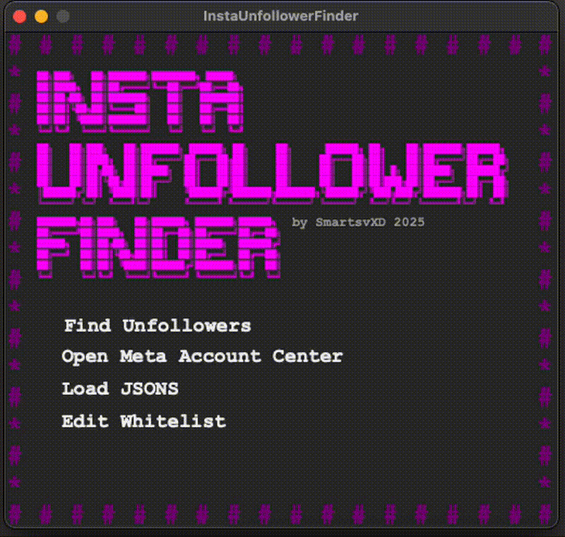
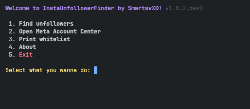

# Run Source Code

## Step 0: Install Python (if necessary)

- If you don’t have Python installed, you can download it from the [official Python website](https://www.python.org/).

## Step 1: Get the Code

- There are two ways to get the source code:
  - Clone the repository if you want the code still in development. You can do this with:

    ``` bash
    git clone https://github.com/SmartsvXD/InstaUnfollowerFinder
    ```

  - If you want a stable version download the source from the [last release](https://github.com/SmartsvXD/InstaUnfollowerFinder/releases).

## Step 2: Install dependencies

- To install the dependencies, open a terminal in the **main project folder** (where `pyproject.toml` is located) and run:

  ```bash
  pip install .
  ```

## Step 3: Download Instagram information

- Read [How to Request and Download Your Instagram Data](../docs/INSTAGRAM_DATA_GUIDE.md).
  
## Step 4a: Run the code with the GUI

<p align="center">
  
</p>

- Move to the cloned repository folder with:  

    ``` bash
    cd path/to/InstaUnfollowerFinder
    ```

- Run `main.py` with:  

    ``` bash
    python3 main.py -t
    ```

- Then follow **Step 2: Find Unfollowers** from the [Run Compiled](COMPILED_GUIDE.md) guide.

## Step 4b: Run the code in the terminal

<p align="center">
  
</p>

- Open:  

    ``` text
    ~/connections/followers_and_following
    ```

- Move `followers.json` and `following_1.json` inside the **"InstaUnfollowerFinder"** directory.
- Move to the cloned repository folder with:  

    ``` bash
    cd path/to/InstaUnfollowerFinder
    ```

- Run `main.py` with:  

  ``` bash
  python3 main.py -t
  ```

  and select **"Find unfollowers"**, if everything is done correctly it should print the list of accounts.
